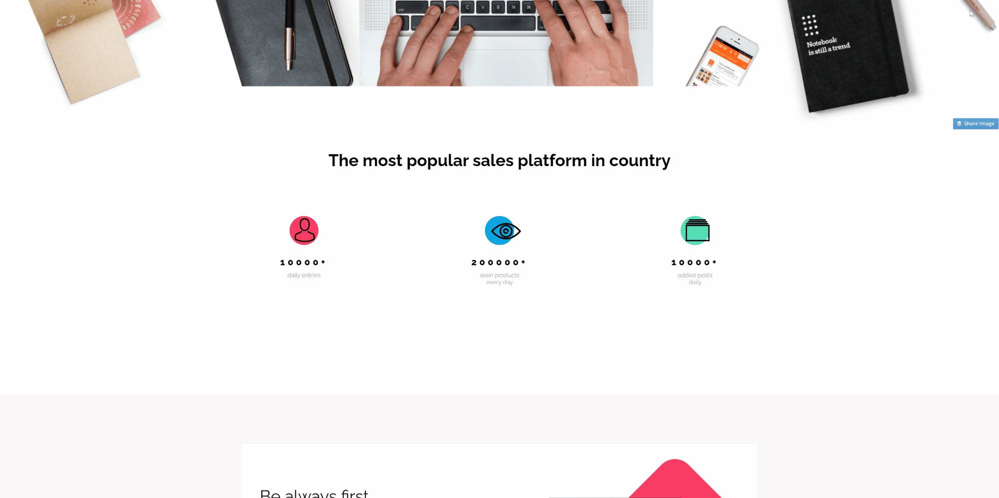
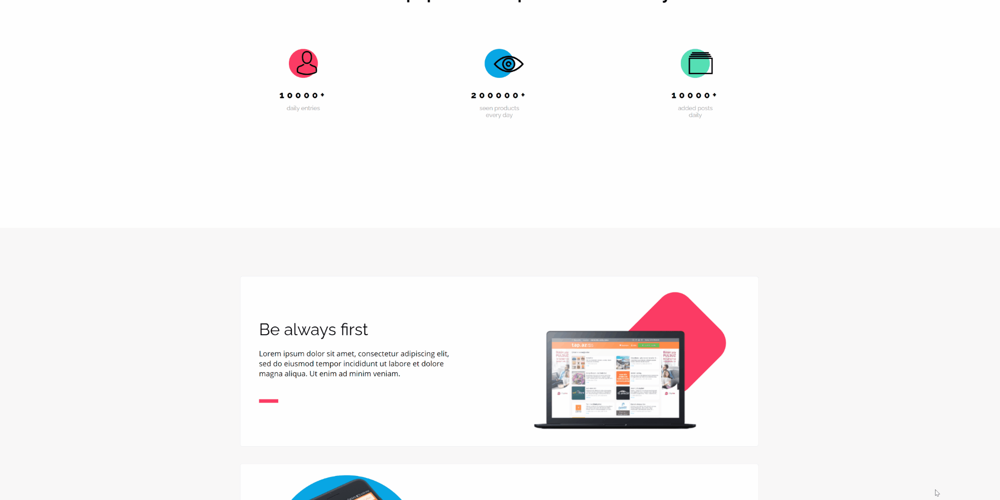

## Zakodowanie frontu strony

**Wykorzystane technologie:** HTML, CSS,
 

**Wykorzystane dodatkowe oprogramowanie:** Adobe Xd

Podczas kodowania layoutu wykorzystano program Adobe Xd. Link do projektu [Projekt BestShop w Adobe Xd](https://xd.adobe.com/view/31804ad0-5f57-46e0-6edf-a5f54c37078a-47b1/).

- Projekt zakodowano (Desktop)
- dodano elementy animacji (in progress)
- na dalszym etapie w miejsce CSS zostanie dodany SaSS oraz JS do odpalania animacji w odpowiednim czasie

**Gotowy projekt zobaczysz [tutaj](https://piotrpawlowski7.github.io/Bestshop/), a kod [tutaj](https://github.com/piotrpawlowski7/Bestshop/).**

